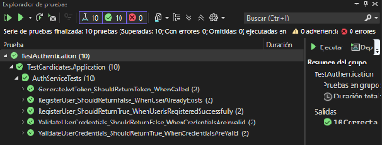

# Tests de funcionalidades backend en entorno local

* Estado: aceptada
* Responsables: Javier Pernaut, Oier Alduncin, Alex Sarango.
* Fecha: 26/02/2025

Historia técnica: [Issue #57](https://github.com/oielay/GTIO_Votacion/issues/57) [Subissue #58](https://github.com/oielay/GTIO_Votacion/issues/58)

## Contexto y Planteamiento del Problema

Para asegurar el correcto funcionamiento de las APIs de Candidatos y de Autenticación y Autorización, es necesario implementar pruebas unitarias y funcionales. Estas pruebas deben verificar que los servicios operan correctamente tanto en un entorno controlado como en un entorno real.

## Factores en la Decisión 

- Necesidad de asegurar la calidad y fiabilidad de los servicios.
- Importancia de validar el registro y autenticación de usuarios.
- Requerimiento de pruebas funcionales para simular escenarios reales de uso.

## Opciones Consideradas

- Implementar solo pruebas unitarias.
- Implementar solo pruebas funcionales.
- Implementar tanto pruebas unitarias como funcionales.

## Decisión

Se decidió implementar tanto pruebas unitarias como funcionales para las APIs de Candidatos y de Autenticación y Autorización. Esta decisión se tomó para garantizar una cobertura completa de pruebas, asegurando que los servicios funcionen correctamente en diferentes escenarios y condiciones.

## Ventajas y Desventajas de las opciones

### Implementar solo pruebas unitarias.

#### Ventajas

- Menor tiempo de desarrollo.
- Menor complejidad en la implementación.

#### Desventajas

- No se validan escenarios reales de uso.
- Posible falta de cobertura en casos de uso complejos.

### Implementar solo pruebas funcionales.

#### Ventajas

- Validación de escenarios reales de uso.
- Mayor confianza en el funcionamiento del sistema en producción.

#### Desventajas

- Mayor tiempo de desarrollo.
- Mayor complejidad en la implementación.

### Implementar tanto pruebas unitarias como funcionales.

#### Ventajas

- Cobertura completa de pruebas.
- Validación tanto en entornos controlados como en escenarios reales de uso.
- Mayor fiabilidad y calidad del sistema.

#### Desventajas
- Mayor tiempo y esfuerzo de desarrollo.
- Mayor complejidad en la implementación y mantenimiento de las pruebas.

## Pruebas realizadas

### Pruebas en la API de Autenticación y Autorización

#### Tests unitarios 
Se implementaron para verificar el correcto funcionamiento del servicio encargado de registrar y validar usuarios. Este servicio genera y devuelve un token con permisos de administrador y una expiración de 1 hora si las credenciales son correctas.

#### Pruebas funcionales
Se realizaron pruebas desde Postman para registrar e iniciar sesión de usuarios, comprobando que estos procesos funcionan correctamente en un entorno real.

### Pruebas en la API de Candidatos
#### Tests unitarios
Se implementaron para asegurar que todas las consultas a la base de datos operan correctamente. Se utilizaron Mocks para simular las respuestas esperadas de la base de datos sin necesidad de interactuar con un entorno real.

#### Pruebas funcionales
Se realizaron a través de Postman, verificando que el CRUD (Create, Read, Update, Delete) se ejecute correctamente y que los endpoints respondan como se espera.

### Configuración y uso de Kong
- Se configuraron los servicios, rutas, consumidores y plugins en Kong.
- Las peticiones se realizan a través de Kong, utilizando tokens generados por el servicio de autenticación.
- Se utilizó el plugin de Kong llamado Prometheus para ver información sobre métricas como la cantidad de peticiones.

### Logs y métricas
- Los logs se almacenan en el contenedor de Kong en la carpeta /tmp.
- Se pueden visualizar los logs de las peticiones realizadas a través de comandos en Docker.
