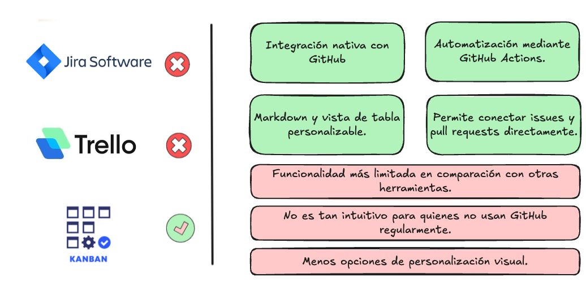
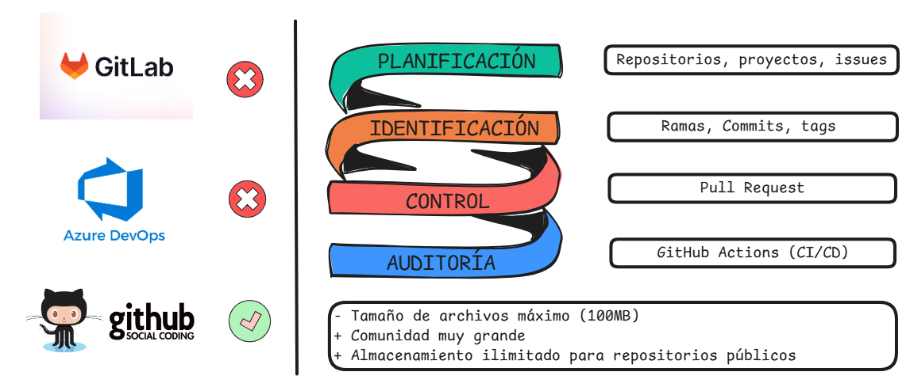
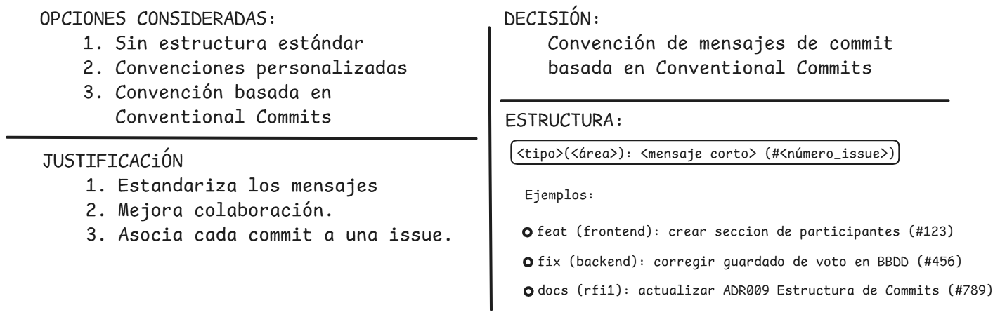
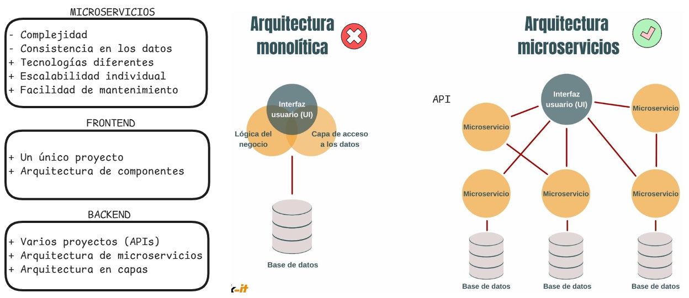
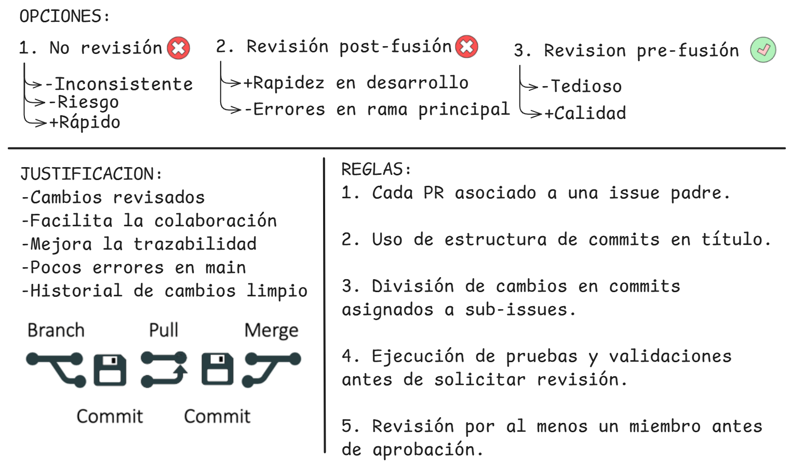
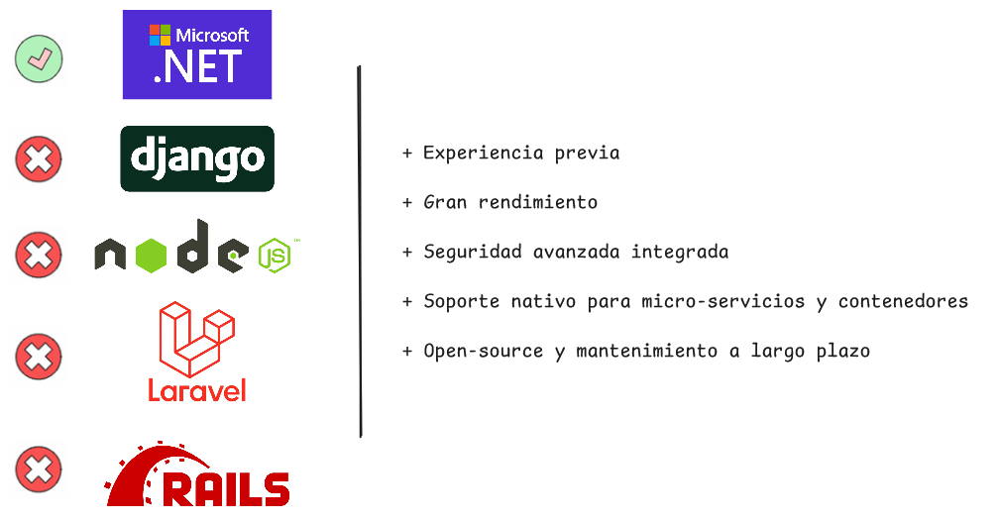
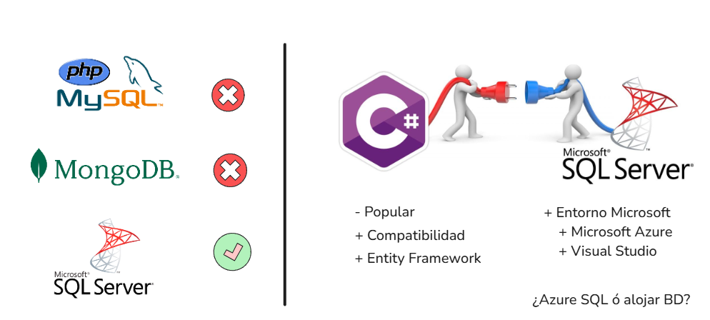

<!-- _class: title -->

# RFI I. Proyecto Votación - Metodologías de Gestión

---

# Organización de la empresa

---

# Miembros y roles

---

# Herramientas para la gestión de proyectos

---

# Herramientas de gestión de la configuración
**GESTIÓN DE LA CONFIGURACIÓN**

---

# Herramientas de gestión de la configuración
**ESTRUCTURA DE COMMITS**

---

# Herramientas de gestión de la configuración
**ARQUITECTURA DEL PROYECTO**

---

# Herramientas de gestión de la configuración
**Pull Requests**

---

# Despliegue en entorno de test local

---

# Arquitectura del programa
**BACKEND**

---

# Arquitectura del programa
**BASE DE DATOS**

