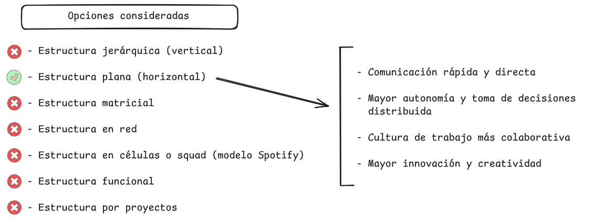
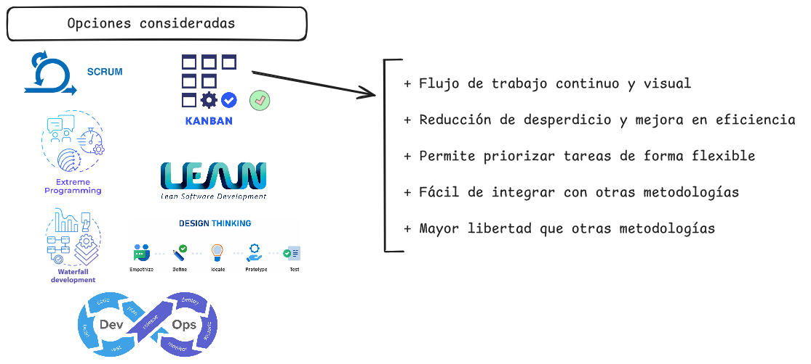
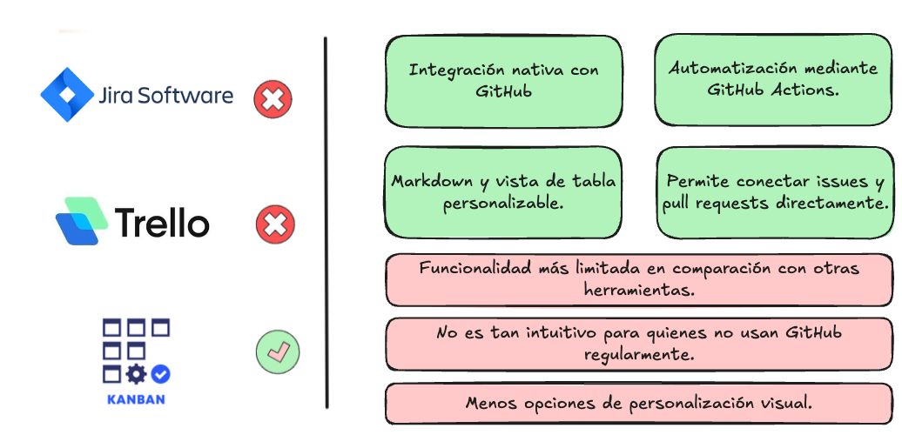
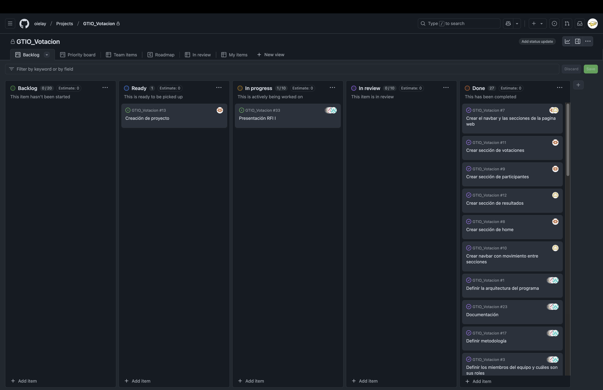
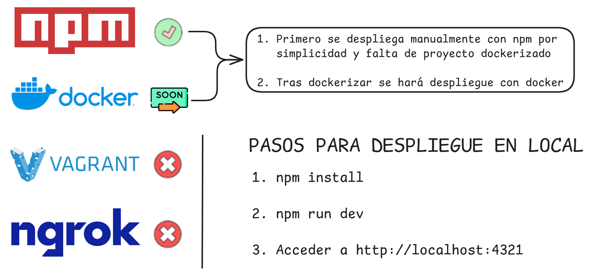
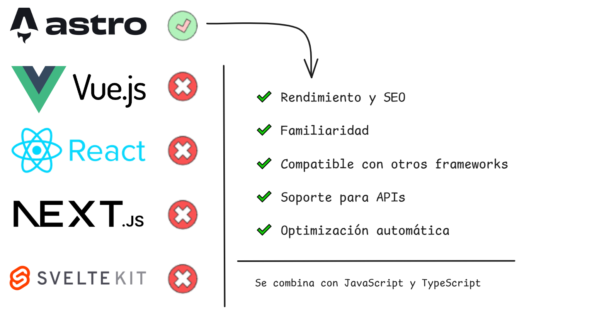

<!-- _class: title -->

# RFI I. Proyecto Votación - Metodologías de Gestión

---

# Organización de la empresa
**ESTRUCTURA DE LA ORGANIZACIÓN DEL EQUIPO**

---

# Organización de la empresa
**METODOLOGÍA**

---

# Miembros y roles

# Herramientas para la gestión de proyectos

**HERRAMIENTAS DE GESTIÓN**

**TABLERO KANBAN**

# Herramientas de gestión de la configuración
**GESTIÓN DE LA CONFIGURACIÓN**

---

# Herramientas de gestión de la configuración
**ESTRUCTURA DE COMMITS**

---

# Herramientas de gestión de la configuración
**ARQUITECTURA DEL PROYECTO**

---

# Herramientas de gestión de la configuración
  **PULL REQUESTS**  

---

# Despliegue en entorno de test local
**DESPLIGUE**  

---

# Arquitectura del programa
**BACKEND**

---

# Arquitectura del programa
 

**FRONTEND**
 

---

# Arquitectura del programa
**BASE DE DATOS**

