<!-- _class: title -->

# RFI I. Proyecto Votación - Metodologías de Gestión

## Autores: Oier A., Urki A., Oier L., Javier P., Álex S.

---

# Organización de la empresa

**ESTRUCTURA DE LA ORGANIZACIÓN DEL EQUIPO**

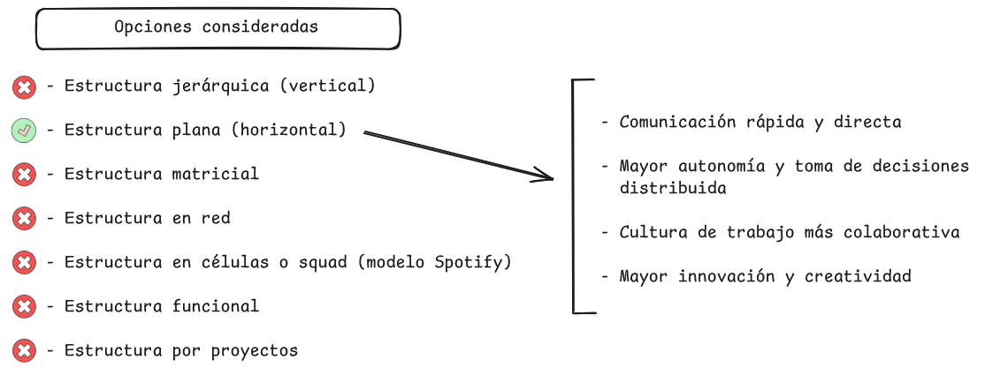

---

# Organización de la empresa

**METODOLOGÍA**

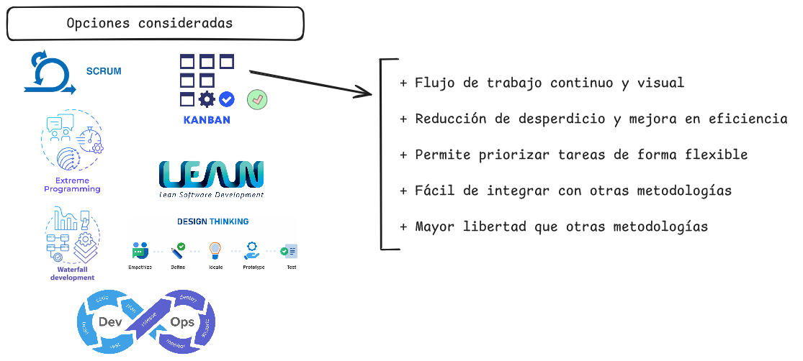

---

# Miembros y roles

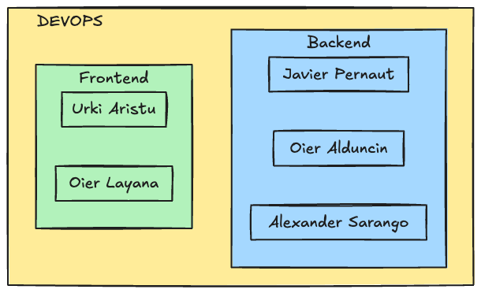

---

# Herramientas para la gestión de proyectos

**HERRAMIENTAS DE GESTIÓN**

---

**TABLERO KANBAN**
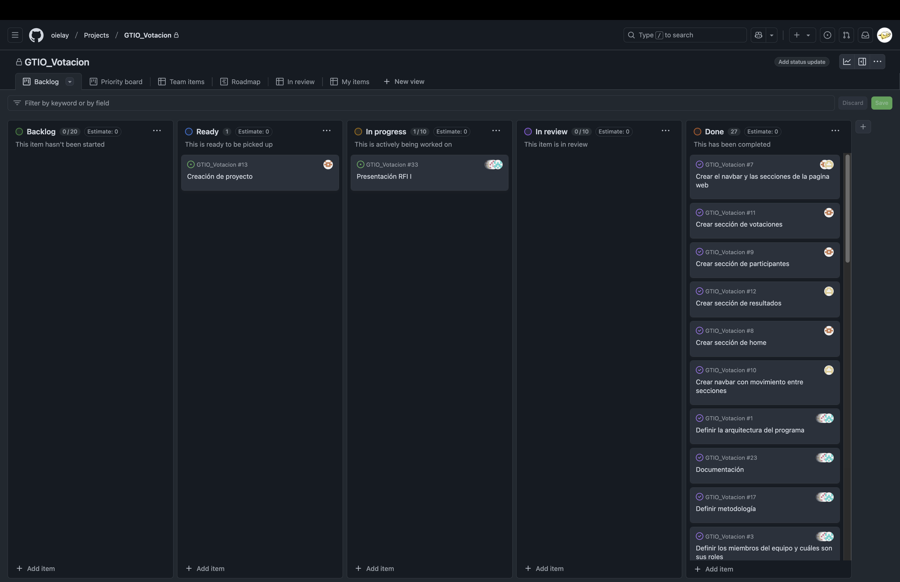

---

# Herramientas de gestión de la configuración

**GESTIÓN DE LA CONFIGURACIÓN**

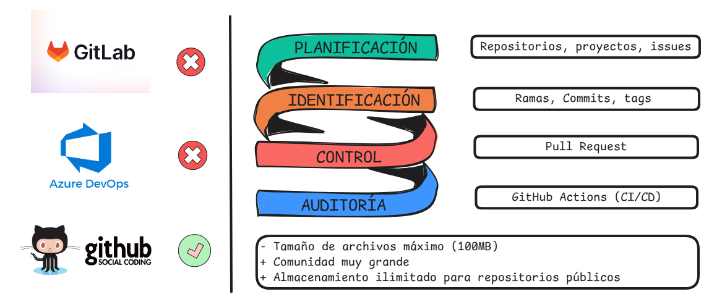

---

# Herramientas de gestión de la configuración

**ESTRUCTURA DE COMMITS**

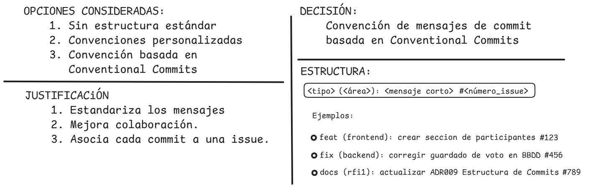

---

# Herramientas de gestión de la configuración

  **PULL REQUESTS**

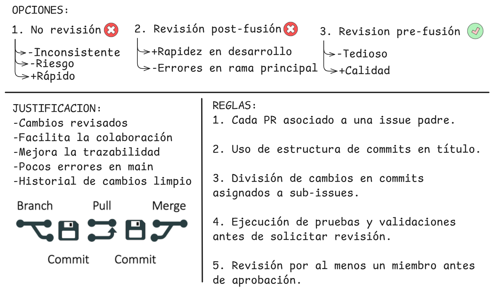

---

# Despliegue en entorno de test local

**DESPLIGUE**

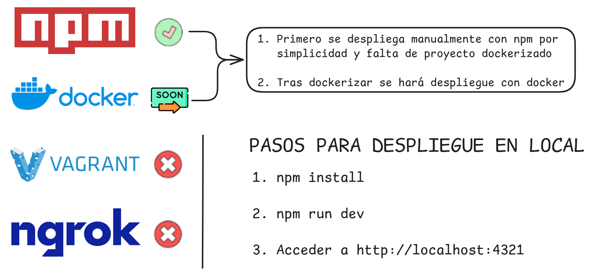

---

# Arquitectura del programa

**ARQUITECTURA DEL PROYECTO**

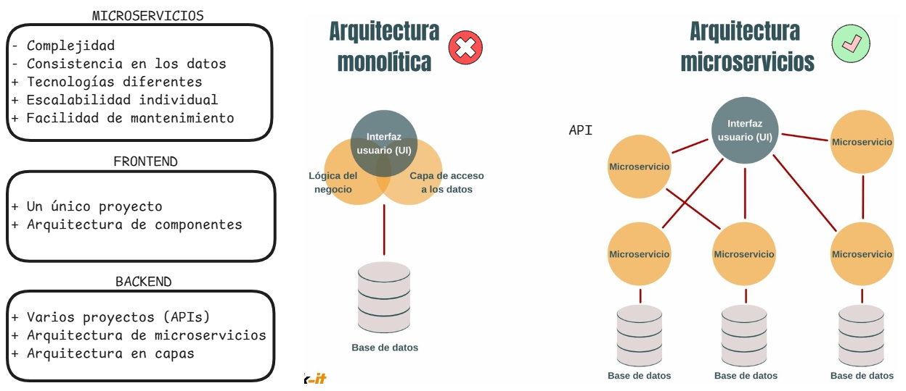

---

# Arquitectura del programa

**BACKEND**

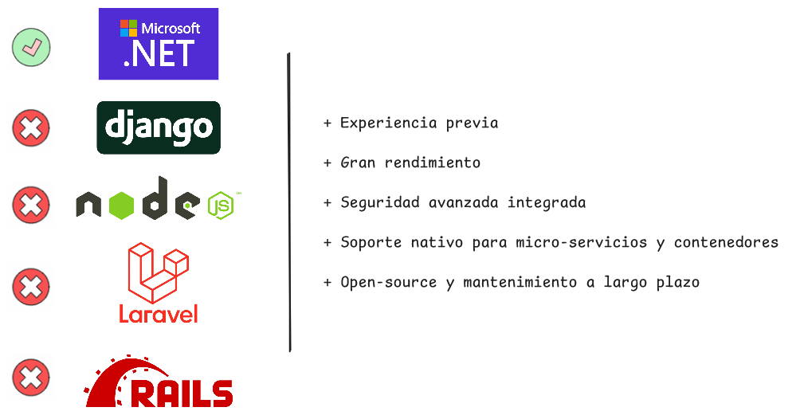

---

# Arquitectura del programa

 

**FRONTEND**
 

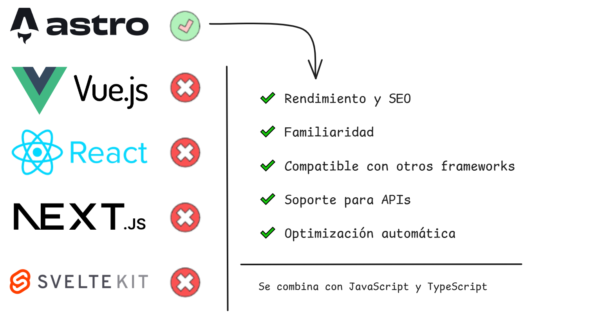

---

# Arquitectura del programa

**BASE DE DATOS**

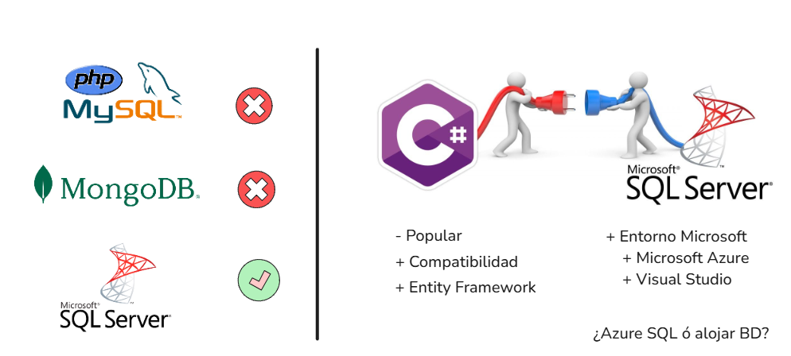

---

<!-- _class: title -->

# Demo
