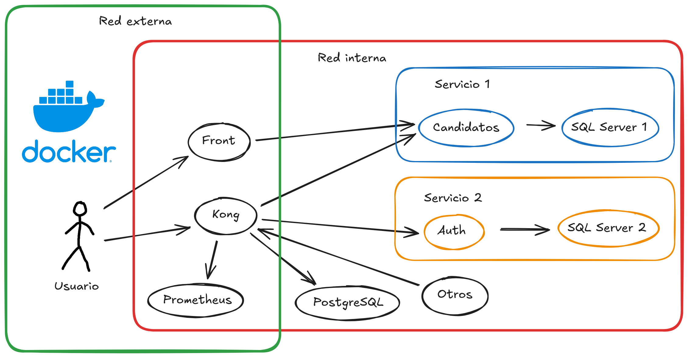
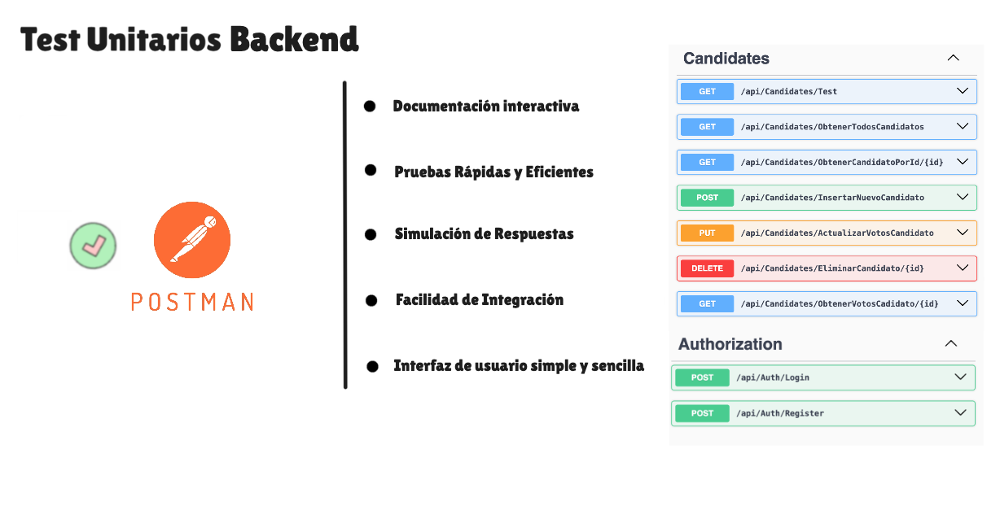

<!-- _class: title -->

# RFI II. Proyecto Votación - Arquitectura Basada en Microservicios

   

## Autores: Oier A., Urki A., Oier L., Javier P., Álex S.

---

# Metodología y buenas prácticas

**METODOLOGÍA DE TRABAJO**

---

# Metodología y buenas prácticas

**BUENAS PRÁCTICAS EN EL BACKEND**

---

# Metodología y buenas prácticas

 

**BUENAS PRÁCTICAS EN EL FRONTEND**

---

# MICROSERVICIOS

---

# FUNCIONALIDAD DE CADA MICROSERVICIO

---

# ARQUITECTURA DE LA SOLUCIÓN

---

# COMUNICACIÓN ENTRE MICROSERVICIOS

---

# DESPLIEGUE EN ENTORNO LOCAL

**CONTINUACIÓN DEL RFI I**

---

# PROBAR FUNCIONALIDADES

**BACKEND**

---

# PROBAR FUNCIONALIDADES

**FRONTEND**

---

# AUTORIZACIÓN, AUTENTICACIÓN Y AUD.

---

# SOLUCIÓN ESCALABLE Y ESLÁSTICA

---

<!-- _class: title -->

# Demo
