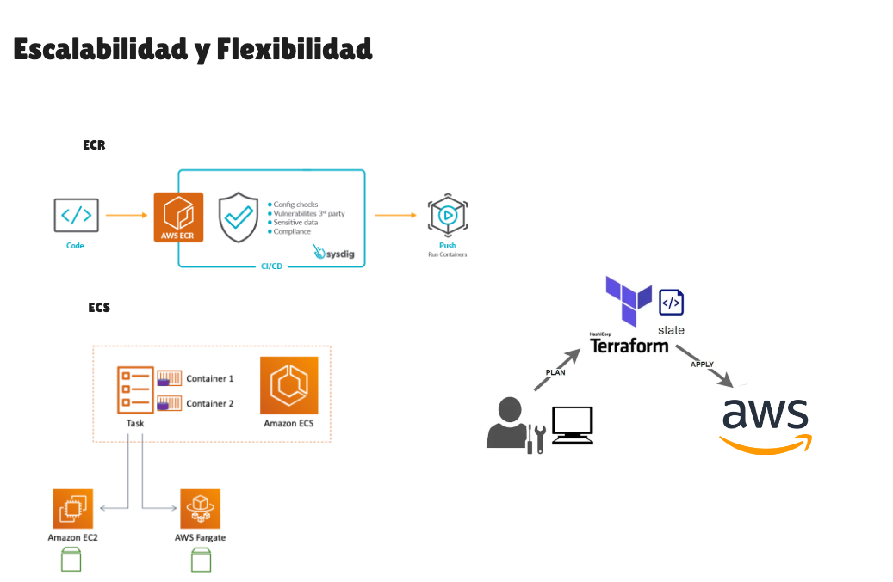
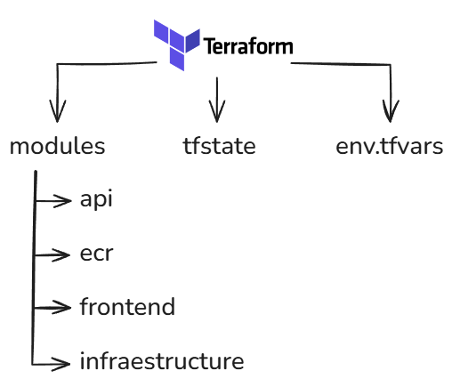

<!-- _class: title -->

# RFI III. Proyecto Votación - CI/CD & Arquitectura Cloud

   

## Autores: Oier A., Urki A., Oier L., Javier P., Álex S.

---

<!-- # ¿Qué vamos a ver?

--- -->

# Servicios necesarios

---

# XD

---

<!-- # Api Gateway

--- -->

# Arquitectura AWS

---

# Escalabilidad y elasticidad

---

# Terraform

---

# CI/CD

---

<!-- _class: title -->

# Demo de AWS
