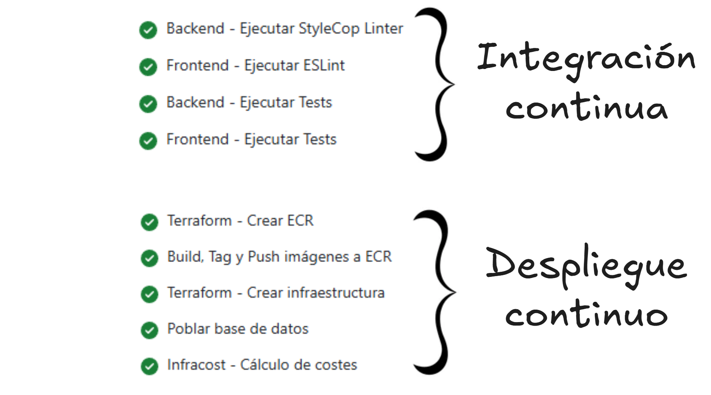
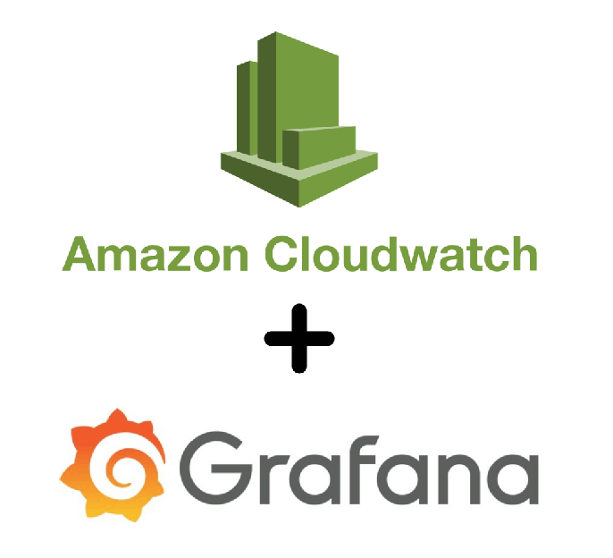

<!-- _class: title -->

# RFP - Proyecto Votación

## Autores: Oier A., Urki A., Oier L., Javier P., Álex S.

---

<!-- _class: title -->

# RFI I. Proyecto Votación - Metodologías de Gestión

---

# Resumen

---

<!-- _class: title -->

# RFI II. Proyecto Votación - Arquitectura Basada en Microservicios

---

# MICROSERVICIOS y FUNCIONALIDAD

---

# ARQUITECTURA Y COMUNICACIÓN ENTRE MICROSERVICIOS

---

# DESPLIEGUE EN ENTORNO LOCAL

**CONTINUACIÓN DEL RFI I**

---

# AUTORIZACIÓN, AUTENTICACIÓN Y AUD.

---

# SOLUCIÓN ESCALABLE Y ESLÁSTICA

---

<!-- _class: title -->

# RFI III - RFP. Proyecto Votación - CI/CD & Arquitectura Cloud

---

# Servicios necesarios

---

<!-- # Api Gateway

--- -->

# Arquitectura AWS

---

# Escalabilidad y elasticidad

---

# Terraform

---

# CI/CD

---

# Metricas / logs

---

# Infracost - Pull Request

 

---

# Infracost - Cloud

 

---

# Costes

### 1. Solución Cloud

#### a. Entorno de desarrollo
- EC2 (instancias Api y Frontend): ~2 x t2.micro → ~$17/mes
- RDS (db.t3.micro, bajo uso): ~$18/mes
- ELB: ~$16/mes (uso compartido)
- Costes totales estimados: **~$51/mes** → **~45€/mes**

---

# Costes

#### b. Entorno de producción
- EC2 (Api, Frontend y Grafana): ~5 x t2.micro → ~$42.5/mes
- RDS : ~$18/mes
- ELB : ~$16/mes
- CloudWatch logs (según retención): $0–2/mes
- Total estimado: **~$75–80/mes** → **~$66–70/mes**

#### c. Entornos de desarrollo locales
- Sin coste en AWS
- Uso de Docker

---

# Costes

### 2. Costes de CI/CD

- Uso de GitHub Actions gratuito
- Uso de Infracost gratuito (cuenta Cloud con límite)
- Almacenamiento de `.env` y `env.tfvars` en S3 (mínimo coste mensual)
- Estimación total: **~1–2€/mes** (solo S3 y posibles logs)

### 3. Costes RRHH

| Rol | Nº Personas | Sueldo medio | Dedicación estmiada| Coste estimado |                   
|--|:--:|:--:|:--:|:--:|
| Desarrollador junior | 5 | 20€/h | 110h | 11.000€

---

# Costes

### 4. Otros costes (licencias e infraestructuras)

- Docker Desktop (uso gratuito en educación)
- Terraform CLI (open source)
- Infracost (open source + cuenta gratuita)
- VS Code / IDEs (gratuitos)
- GitHub (gratuito)
- Total estimado: **$0**

---

# Costes

### Total
| Aspecto | Coste mensual |  Coste Anual   |               
|--|--:|--:|
| Entorno Desarrollo | 45€/mes | 540€/año |
| Entorno Produccion | 70€/mes | 840€/año |
| Entorno Desarrollo Local  | 0€/mes | 0€/año |
| CI/CD | 2€/mes | 24€/año |
| **Total** | **117€/mes** | **1404€/año** |

| RRHH | Horas/trabajador | Coste hora | Coste Total |
|--|:--:|:--:|:--:|             
| 5 prog. jr. | 110h | 20€/h | **11.000€** |

---

