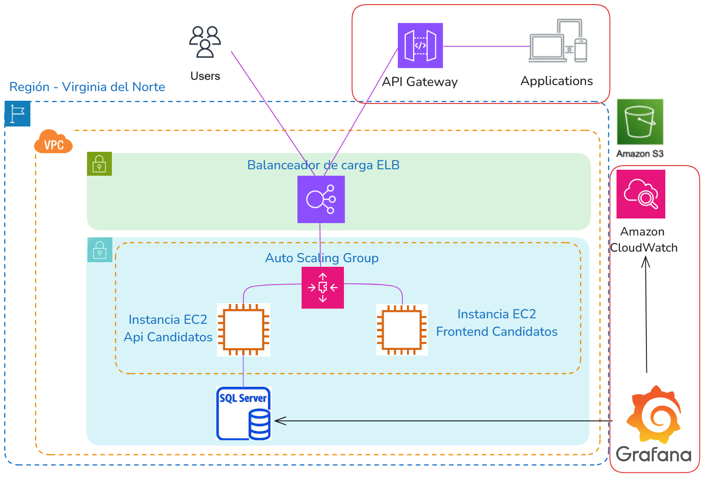

<!-- _class: title -->

# RFI I. Proyecto Votación - Metodologías de Gestión

## Autores: Oier A., Urki A., Oier L., Javier P., Álex S.

---

# Resumen

---

<!-- _class: title -->

# RFI II. Proyecto Votación - Arquitectura Basada en Microservicios

   

## Autores: Oier A., Urki A., Oier L., Javier P., Álex S.

---

# MICROSERVICIOS y FUNCIONALIDAD

---

# ARQUITECTURA Y COMUNICACIÓN ENTRE MICROSERVICIOS

---

# DESPLIEGUE EN ENTORNO LOCAL

**CONTINUACIÓN DEL RFI I**

---

# AUTORIZACIÓN, AUTENTICACIÓN Y AUD.

---

# SOLUCIÓN ESCALABLE Y ESLÁSTICA

---

<!-- _class: title -->

# RFI III - RFP. Proyecto Votación - CI/CD & Arquitectura Cloud

   

## Autores: Oier A., Urki A., Oier L., Javier P., Álex S.

---

# Servicios necesarios

---

<!-- # Api Gateway

--- -->

# Arquitectura AWS

---

# Escalabilidad y elasticidad

---

# Terraform

---

# CI/CD

---

